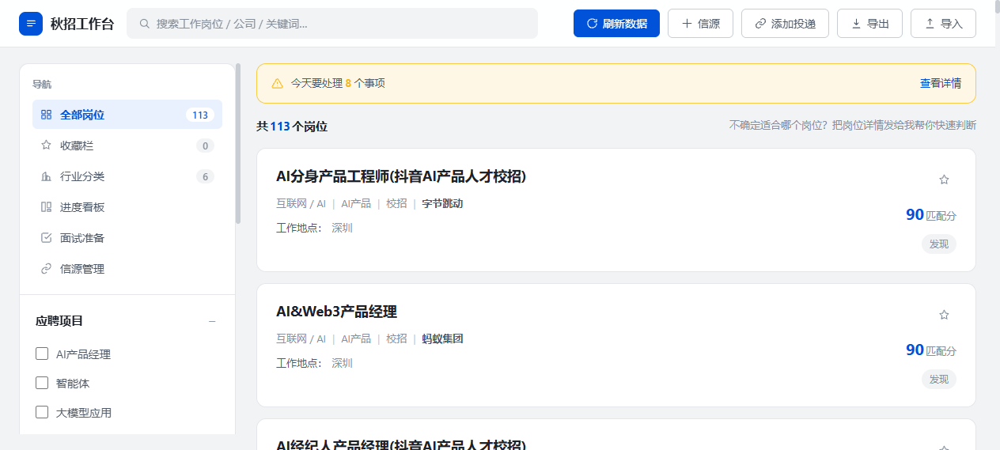

# 秋招工作台（公开快照）

李卓衡的 2027 秋招求职管理系统 —— AI 驱动的岗位扫描、匹配评分与求职流程管理。

**在线访问**：<https://lizhuoheng273-debug.github.io/workbench/>



## 这是什么

一个仿腾讯招聘风格的求职工作台，把「找岗位 → 评匹配 → 追进度 → 备面试」收进一个界面：

| 模块 | 能力 |
|---|---|
| 💼 **全部岗位** | 每条岗位带 **GLM 匹配分**（0–100）与评分理由（语言要求、AI/金融科技契合度等）· 全局搜索（岗位 / 公司 / 关键词）· 按应聘项目（AI 产品经理 / 智能体 / 大模型应用）筛选 · 按扫描日期分组追踪新旧 |
| ⭐ **收藏栏** | 一键收藏目标岗位 |
| 🗂 **行业分类** | 按行业维度归类浏览 |
| 📊 **进度看板** | 投递状态流转（发现 → 投递 → 面试 → Offer），添加投递自动登记 |
| ✅ **面试准备** | 按岗位沉淀面试准备材料 |
| 🔗 **信源管理** | 管理岗位扫描的信源（各公司招聘官网等） |
| ⇅ **导入 / 导出** | 数据一键备份与迁移 |

## 实现方式

本仓库是本地完整版的**纯静态公开快照**：

- **本地完整版**：Python + Flask + SQLite + 智谱 GLM——每日定时扫描信源抓取新岗位，LLM 结构化解析 JD 并计算匹配分，数据落库管理。
- **本快照**：单文件 `index.html`，数据内嵌于页面（`window.__WB__`），纯静态、无任何后端依赖，直接托管在 GitHub Pages。

## 结构

```
workbench/
├── index.html            # 秋招工作台（自包含单文件）
├── .nojekyll             # 禁用 Jekyll 处理
└── README.md
```

## 更新

本地重新扫描生成后，运行 `秋招工作台/发布到Pages.bat` 把最新快照推送上线。

## 说明

仅供浏览参考；数据为阶段性快照，岗位信息以各公司官方招聘页面为准。
